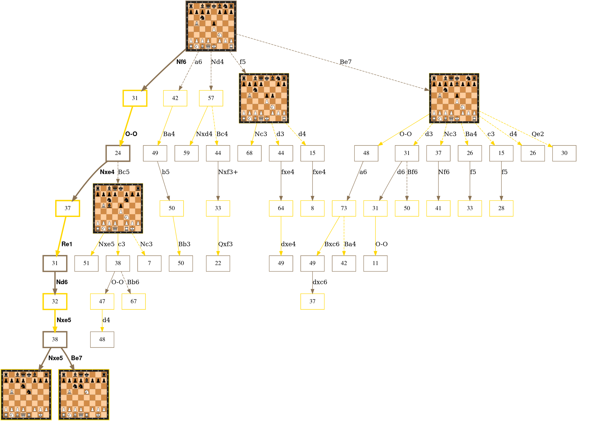

# chessgraph

An utility to create a graph of moves from a specified position.

## examples



This image was generated using:

```bash
python chessgraph.py  --depth=8 --alpha=30 --beta=50 --concurrency 32 --source engine --engine stockfish\
                      --enginedepth 18 --boardstyle svg --position="r1bqkbnr/pppp1ppp/2n5/1B2p3/4P3/5N2/PPPP1PPP/RNBQK2R b KQkq - 0 1"
dot -Tsvg chess.dot -o chess.svg
firefox chess.svg
```

The [svg image](https://github.com/vondele/chessgraph/raw/main/spanish.svg), (this time generated with unicode chess pieces) 
contains links to the online [Chess Cloud Database](https://chessdb.cn/queryc_en/) that can be queried to generate the graph. 

The chessgraph tool is based on [graphviz](https://graphviz.org/),
which must be available to convert the `.dot` file to an image format such as `.svg` or `.png`.

## interpretation of the graph

The graph shows possible moves (edges) from each position (nodes).
Nodes in yellow are white to move, nodes in brown are black to move. 
The numbers shown in the node are the evaluation of the position (white point of view).
Nodes with multiple available moves (several leaving edges) have a board shown.
Edges that represent sub-optimal moves are shown dashed.
The best variation (principal variation, PV) is shown with a thick solid line.

## more options

More options are available to visualize a tree. For example, allowing a local chess engine for analysis, changing the depth, or using images for the boards. The shape of the tree (and the cost of generating it), is strongly affected by the alpha, beta, and depth parameters. Start at low depth, and narrow [alpha, beta] range.

```
usage: chessgraph.py [-h] [--depth DEPTH] [--alpha ALPHA] [--beta BETA] [--concurrency CONCURRENCY] [--position POSITION] [--source {chessdb,engine}]
                     [--boardstyle {unicode,svg,none}] [--boardedges BOARDEDGES] [--engine ENGINE] [--output OUTPUT] [--enginedepth ENGINEDEPTH]

An utility to create a graph of moves from a specified chess position.

options:
  -h, --help            show this help message and exit
  --depth DEPTH         Maximum depth (in plies) of a followed variation (default: 6)
  --alpha ALPHA         Lower bound on the score of variations to be followed (for white) (default: 0)
  --beta BETA           Lower bound on the score of variations to be followed (for black) (default: 15)
  --concurrency CONCURRENCY
                        Number of cores to use for work / requests. (default: 32)
  --position POSITION   FEN of the starting position. (default: rnbqkbnr/pppppppp/8/8/8/8/PPPPPPPP/RNBQKBNR w KQkq - 0 1)
  --source {chessdb,engine}
                        Use chessdb or engine to score and rank moves (default: chessdb)
  --boardstyle {unicode,svg,none}
                        Which style to use to visualize a board. (default: unicode)
  --boardedges BOARDEDGES
                        Minimum number of edges needed before a board is visualized in the node. (default: 3)
  --engine ENGINE       Name of the engine binary (with path as needed). (default: stockfish)
  --output OUTPUT, -o OUTPUT
                        Name of the output file used. (default: chess.dot)
  --enginedepth ENGINEDEPTH
                        Depth of the search used by the engine in evaluation (default: 20)

```
