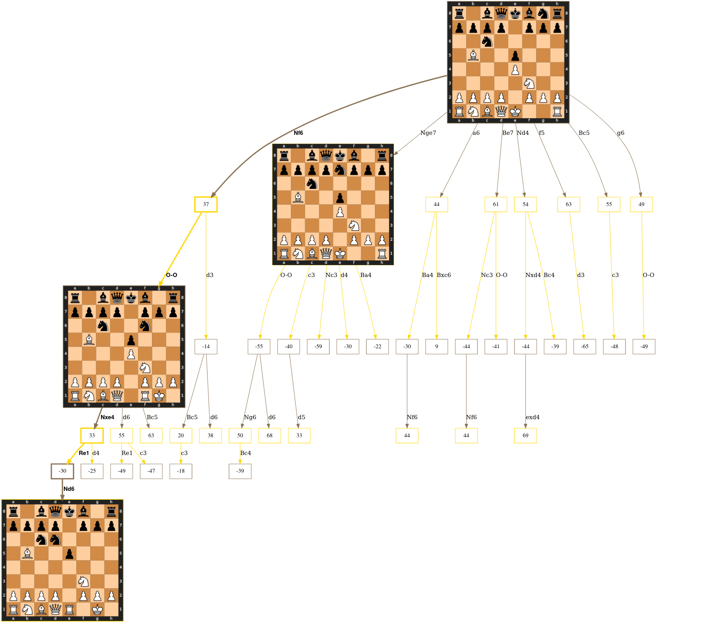
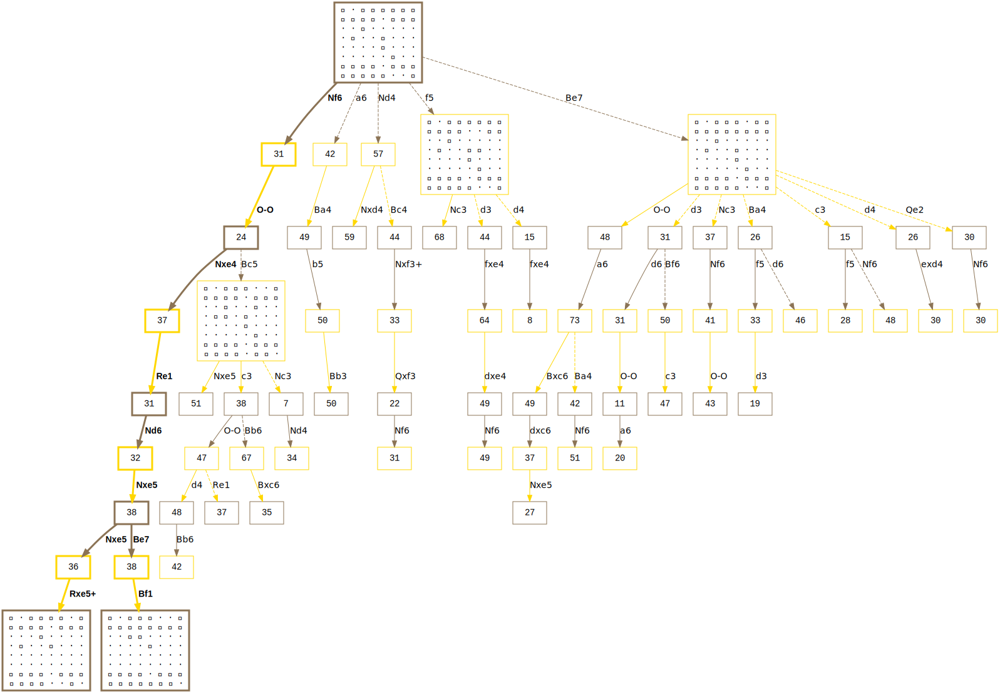

# chessgraph

An utility to create a graph of moves from a specified position.

## examples



This image was generated using:

```bash
time python chessgraph.py  --depth=6 --alpha=-60 --beta=-15 --position="r1bqkbnr/pppp1ppp/2n5/1B2p3/4P3/5N2/PPPP1PPP/RNBQK2R b KQkq - 3 3"\
                           --concurrency 32 --source engine --engine stockfish --enginedepth 22 --boardstyle svg > chess.dot
dot -Tsvg chess.dot -o chess.svg
firefox chess.svg

```



This image was generated using:

```bash
python chessgraph.py  --depth=10 --alpha=-20 --beta=0 --position="r1bqkbnr/pppp1ppp/2n5/1B2p3/4P3/5N2/PPPP1PPP/RNBQK2R b KQkq - 3 3" > spanish.dot
dot -Tsvg spanish.dot -o spanish.svg
```

The [svg image](https://github.com/vondele/chessgraph/raw/main/spanish.svg) contains links
to the online [Chess Cloud Database](https://chessdb.cn/queryc_en/) that is queried to generate the graph. 
Use a browser to visualize the image.

The chessgraph tool is based on [graphviz](https://graphviz.org/), which must be available to convert the `.dot` file to an image format such as `.svg` or `.png`.

Whereas the former can have embedded links to latter might be more convient to share and modify. Generate a high-resolution version as:

```bash
dot -Tpng -Gdpi=300 spanish.dot -o spanish.png
```


## more options

more options are available to visualize a tree. For example, allowing a local chess engine for analysis, changing the depth, or using images for the boards. The shape of the tree (and the cost of generating it), is strongly affected by the alpha, beta, and depth parameters. Start at low depth, and narrow [alpha, beta] range.

```
usage: chessgraph.py [-h] [--depth DEPTH] [--alpha ALPHA] [--beta BETA] [--concurrency CONCURRENCY] [--position POSITION] [--source {chessdb,engine}] [--boardstyle {unicode,svg,none}]
                     [--boardedges BOARDEDGES] [--engine ENGINE] [--enginedepth ENGINEDEPTH]

options:
  -h, --help            show this help message and exit
  --depth DEPTH         Maximum depth (in plies) of a followed variation
  --alpha ALPHA         Lower bound on the score of variations to be followed
  --beta BETA           Upper bound on the score of variations to be followed
  --concurrency CONCURRENCY
                        Number of cores to use for work / requests.
  --position POSITION   FEN of the starting position.
  --source {chessdb,engine}
                        Use chessdb or engine to score and rank moves
  --boardstyle {unicode,svg,none}
                        Which style to use to visualize a board.
  --boardedges BOARDEDGES
                        Minimum number of edges needed before a board is visualized in the node.
  --engine ENGINE       Name of the engine binary (with path as needed).
  --enginedepth ENGINEDEPTH
                        Depth of the search used by the engine in evaluation
```
